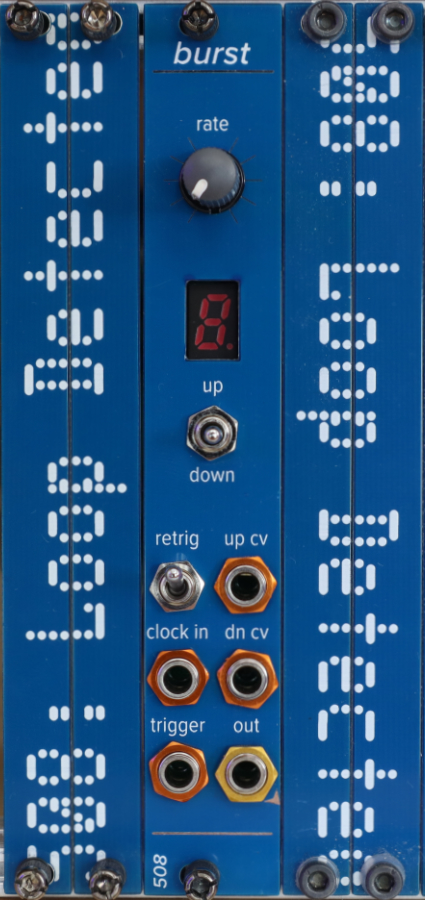

# burst

This module started out as a breadboard implementation of Ken Stone's Catgirl Burst module, but as I started playing around with it, I decided I wanted to re-implement it with a 4081 in place of the passive diode ANDs, and then I figured I already had most of a 7-segment up/down counter circuit in another reverb module design of mine, and from there it was suddenly obvious that what it needed was the ability to increase/decrease the number of triggers per burst using a trigger in, so by the time I was done with it, it was about 3x as complicated as Ken's design.

So that's what you get: bursts of triggers, from 2 to 9, with a 7-segment display & a momentary toggle switch to control the number of triggers, plus up/down incrementing of that number via CV (OK, really clock/trigger) inputs.

The 7-segment display is pretty small, so in order to get it sit anywhere close to the panel, I use 2mm-pitch female headers (same ones I use for board-to-board connections. The specific 7-segment I use is this one: https://mou.sr/44XUS4N

Trimming is as follows:

- VR2 -> 5v (there's a test point to check this)
- VR1 -> the reference voltage for the comparators cleaning up the triggers from the CV inputs and the up/down switch
- VR7 -> the reference voltage for the comparators cleaning up the clock and trigger inputs 

This module, like many of my modules, uses 2mm-pitch male/female headers. Be sure you order/use the right thing!
